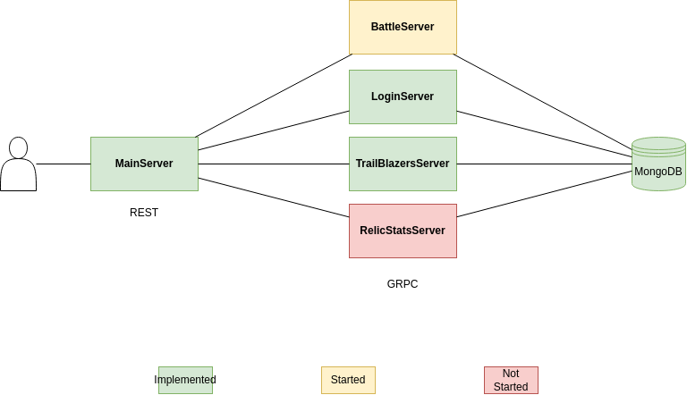

<div align="center">
<a href="#overview"><kbd> <br> Overview<br> </kbd></a>&ensp;&ensp;
<a href="#installation"><kbd> <br> Installation <br> </kbd></a>&ensp;&ensp;
<a href="#next steps"><kbd> <br> Next steps <br> </kbd></a>&ensp;&ensp;
</div>

<https://github.com/GoncaloP0710/Honkai-Starbucks/README-Files/preview.mp4>

---

<a id="overview"></a>


> [!IMPORTANT]
> The project is currently under active development. 
> Features and functionalities are being added and refined. 
> Please note that some parts of the project may not be fully functional or stable at this stage. 

<div align="center">
    
</div>

This project consists of several components for managing and simulating battles in the Honkai-StarBucks universe. It includes back-end servers for handling different functionalities and a front-end client built with Angular.

`Honkai-StarBucks_MainServer` - This is the entry point of the system. It acts as a central router that handles initial requests from the frontend and delegates them to the appropriate microservices. It helps decouple the frontend from direct dependencies on individual services, promoting scalability and maintainability.

`Honkai-StarBucks_LoginServer` - Responsible for handling user authentication and account-related operations, this service connects to a MongoDB database to store and manage login credentials. Currently, database encryption is pending but planned for future implementation to ensure user data security.

`Honkai-StarBucks_TrailBlazersServer` - This microservice manages player data and team configurations. It connects to MongoDB to store detailed information about each user’s characters and their team setups. Additionally, it integrates with starrail.js to retrieve game-specific data. It supports features like creating and deleting teams...

`Honkai-StarBucks_BattleServer` - Currently under development, this microservice will encapsulate all battle-related logic. It will be responsible for processing combat mechanics, handling real-time battle scenarios, and ensuring fair and balanced gameplay outcomes. Once implemented, it will form the core gameplay loop of the application.

> [!CAUTION]
> Inter-service Communication: Microservices currently communicate using Axios for HTTP-based messaging. 
> There are plans to upgrade to gRPC, which will provide faster, more efficient communication and better support for future scaling needs. 

---

<a id="tech used"></a>


<div align="center">
    <ul>
    <a href="https://nodejs.org/en" target="_blank">Node.js</a>
    <a href="https://angular.dev/" target="_blank">Angular</a>
    <a href="https://github.com/mongodb/mongo" target="_blank">MongoDB</a>
    <a href="https://github.com/yuko1101/starrail.js" target="_blank">StarRail.js</a>
    </ul>
</div>

---

<a id="next steps"></a>


<div align="center">
    <p><strong>PvP:</strong> Face other players by trying to clear MoC faster.</p>
    <p><strong>Team Stats:</strong> Get stats of your team to help create the best one possible.</p>
    <p><strong>Relic/Build Stats:</strong> Evaluate your relics and builds.</p>
    <p><strong>Guides:</strong> Guides for building every character.</p>
    <p><strong>News:</strong> All the most recent news of the game.</p>
</div>

---

<a id="installation"></a>


- Windows

    Run the `start_servers.bat` file to start the servers:
    ```sh
    .\start_servers.bat
    ```

- Linux 

    Run the `start_servers.sh` file to start the servers:
    ```sh
    ./start_servers.sh
    ```